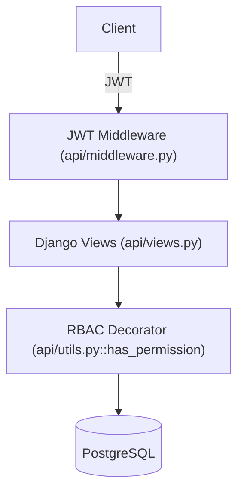
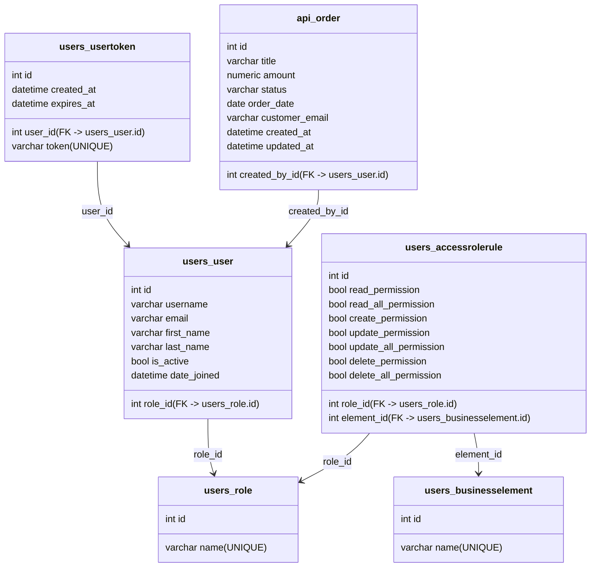
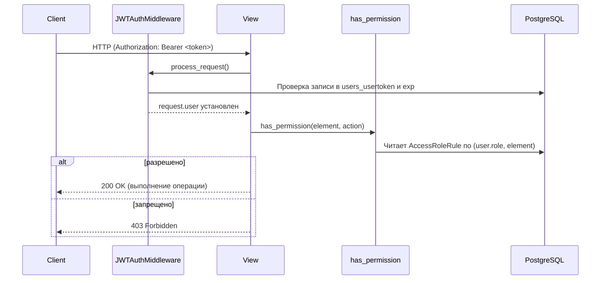

# 🔐 Auth API — RBAC + JWT на Django

REST API на Django 4.2 с аутентификацией по JWT и авторизацией по ролевой модели (RBAC).  
Используется PostgreSQL (через Docker), валидация токена на уровне middleware и проверка прав на уровне бизнес-элементов.

---

## 📚 Содержание
- [Описание проекта](#-описание-проекта)
- [Архитектура](#-архитектура)
- [Схема БД](#-схема-бд)
- [JWT и авторизация](#-jwt-и-авторизация)
- [API эндпоинты](#-api-эндпоинты)
- [Примеры ответов](#-примеры-ответов)
- [Переменные окружения](#переменные-окружения)
- [Запуск проекта](#-запуск-проекта)
- [Коллекция запросов (BRUNO)](#-коллекция-запросов-bruno)
- [Структура проекта](#-структура-проекта)

---

## 🧭 Описание проекта
- Фреймворк: Django 4.2
- БД: PostgreSQL (через Docker)
- Аутентификация: JWT в заголовке `Authorization: Bearer <token>`
- Авторизация: RBAC по бизнес-элементам (таблица `users_accessrolerule`)
- JWT TTL: 30 минут (`JWT_ACCESS_TOKEN_LIFETIME=1800`) + хранение записей токенов в `users_usertoken` (с `expires_at` +7 дней)
- Swagger: `/swagger/`
- ReDoc: `/redoc/`

Основные возможности:
- Регистрация и вход с выдачей JWT
- Logout с инвалидацией текущего токена
- RBAC на основе ролей и бизнес-элементов
- CRUD по заказам с bulk-операциями
- Документация Swagger/Redoc

---

### 🏗 Архитектура


---

## 🗃 Схема БД



---

## 🔐 JWT и авторизация



Пример входа (получение токена):
```bash
curl -X POST http://localhost:8000/api/public/login/ \
  -H "Content-Type: application/json" \
  -d '{"username":"john","password":"P@ssw0rd!"}'
```

Пример ответа (успешный логин):
```json
{
  "token": "<JWT>",
  "expires_at": "2025-10-12T12:00:00Z",
  "user": {
    "id": 1,
    "username": "john",
    "email": "john@example.com",
    "first_name": "John",
    "last_name": "Doe",
    "is_active": true,
    "date_joined": "2025-10-12T10:00:00Z"
  }
}
```

Заголовок авторизации для защищённых эндпоинтов:
```http
Authorization: Bearer <JWT>
```

---

## 🌐 API эндпоинты

| Роль    | Метод | URL                               | Описание                                |
|---------|-------|-----------------------------------|------------------------------------------|
| Public  | POST  | `/api/public/register/`           | Регистрация                              |
| Public  | POST  | `/api/public/login/`              | Вход, получение JWT                      |
| Client  | POST  | `/api/client/logout/`             | Выход, инвалидация текущего токена       |
| Client  | GET   | `/api/client/profile/`            | Профиль текущего пользователя            |
| Admin   | GET   | `/api/admin/roles/`               | Список ролей                             |
| Admin   | GET   | `/api/admin/rules/`               | Список правил доступа                    |
| Admin   | PATCH | `/api/admin/rules/{rule_id}/`     | Обновить флаги доступа                   |
| Admin   | PATCH | `/api/admin/users/{user_id}/`     | Сменить роль пользователя                |
| Manager | GET   | `/api/manager/orders/`            | Список заказов                           |
| Manager | POST  | `/api/manager/orders/`            | Создать заказ или несколько (bulk)       |
| Manager | DELETE| `/api/manager/orders/`            | Удалить несколько по `ids`               |
| Manager | GET   | `/api/manager/orders/{order_id}/` | Получить один заказ                      |
| Manager | PATCH | `/api/manager/orders/{order_id}/` | Частичное обновление (в т.ч. статус)     |
| Manager | DELETE| `/api/manager/orders/{order_id}/` | Удалить один (возврат `{success,message}`)|

---

## 📬 Примеры ответов

200 OK:
```json
{"success": true, "message": "Order deleted successfully"}
```

401 Unauthorized (нет/невалидный токен):
```json
{"detail": "Unauthorized"}
```
или (из middleware):
```json
{"detail": "Invalid token"}
```

403 Forbidden (нет права в RBAC):
```json
{"detail": "Forbidden"}
```

---

## Переменные окружения

```ini
DEBUG=True
SECRET_KEY=dev-secret
DB_NAME=auth_db
DB_USER=auth_user
DB_PASSWORD=auth_pass
DB_HOST=localhost
DB_PORT=5432
SALT=dev_salt
```

Совет: значения `DB_USER/DB_PASSWORD/DB_NAME` должны соответствовать [docker-compose.yml]

---

## 🐳 Запуск проекта
Гибридный режим: БД в Docker, Django — локально через терминал.

1) Поднять БД:
```bash
docker compose up -d db
```

2) Установить зависимости:
```bash
python -m venv venv
# Windows:
venv\Scripts\activate
# Linux/macOS:
# source venv/bin/activate

pip install -r requirements.txt
pip install djangorestframework drf-yasg PyJWT
```

3) Применить миграции и запустить сервер:
```bash
python manage.py migrate
python manage.py runserver 0.0.0.0:8000
```

Проверка:
- Swagger: http://localhost:8000/swagger/
- Redoc: http://localhost:8000/redoc/
- API: http://localhost:8000/api/

---

## 🧪 Коллекция запросов (BRUNO)
В репозитории `BRUNO/` находится предварительно настроенная коллекция запросов для Bruno. 

### Как использовать:
1. Установите [Bruno](https://www.usebruno.com/) (если ещё не установлен)
2. В Bruno: `File` → `Open Workspace` → выберите папку `BRUNO/` из проекта
3. Всё готово! В коллекции уже настроены:
   - Базовый URL: `http://localhost:8000/api`
   - Переменные окружения (Environment)
   - Группы запросов по ролям (Public, Client, Admin, Manager)

### Важно:
- Убедитесь, что сервер запущен на `http://localhost:8000`
---

## 🧭 Структура проекта
```text
auth_system/
├─ .env
├─ docker-compose.yml         # поднимает Postgres (порт 5432)
├─ manage.py
├─ requirements.txt
├─ api/
│  ├─ models.py               # Order
│  ├─ admin_views.py          # /api/admin/*
│  ├─ manager_views.py        # /api/manager/orders/*
│  ├─ middleware.py           # JWTAuthMiddleware
│  ├─ utils.py                # has_permission, JWT utils
│  ├─ schema.py               # Swagger/Redoc настройки
│  ├─ urls.py                 # урлы(роутинг)/api/*
│  └─ views.py                # public/client
├─ config/
│  ├─ middleware.py           # DisableCSRFMiddleware (для /api/*)
│  ├─ roles.py                # Enum Role/BusinessElement
│  ├─ settings.py             # Postgres + JWT
│  └─ urls.py                 # admin/, api/, swagger/, redoc/
├─ users/
│  ├─ models.py               # Role, BusinessElement, User, UserToken, AccessRoleRule
│  └─ helpers.py              # get_user_by_token / get_user_by_id
└─ BRUNO/                     # коллекция Bruno
```